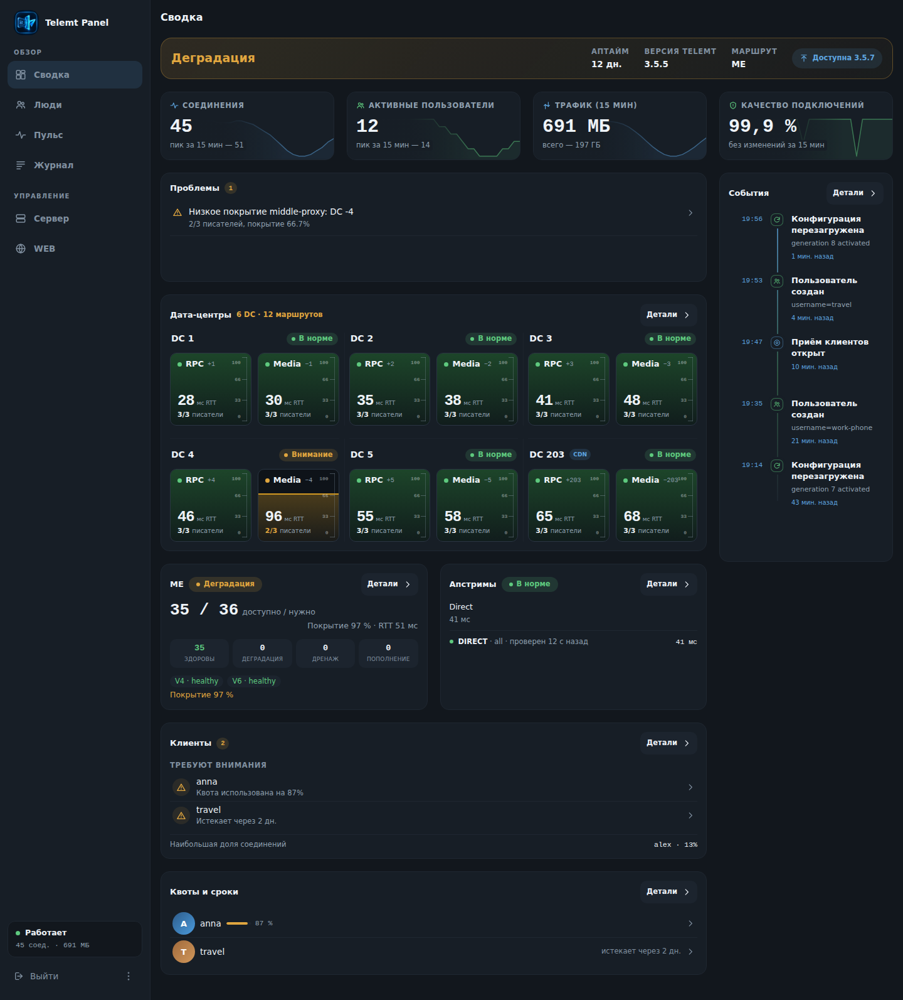
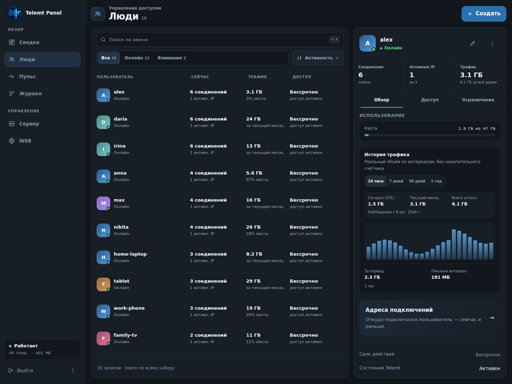
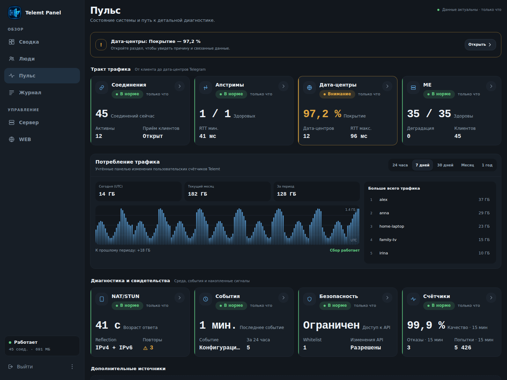
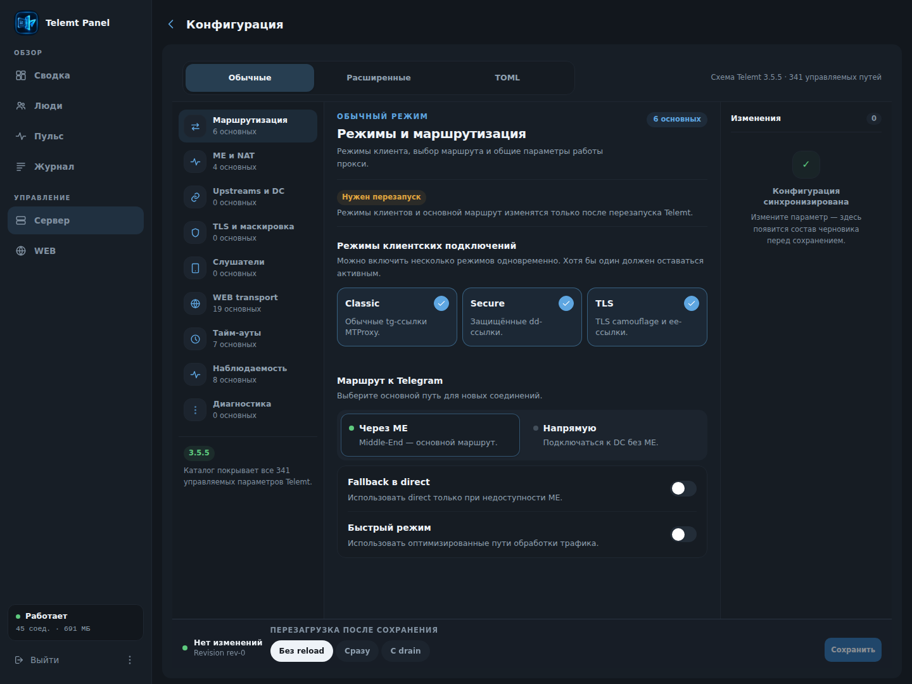
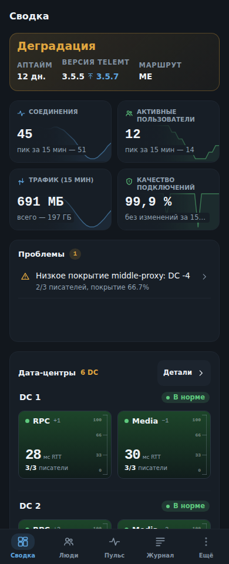
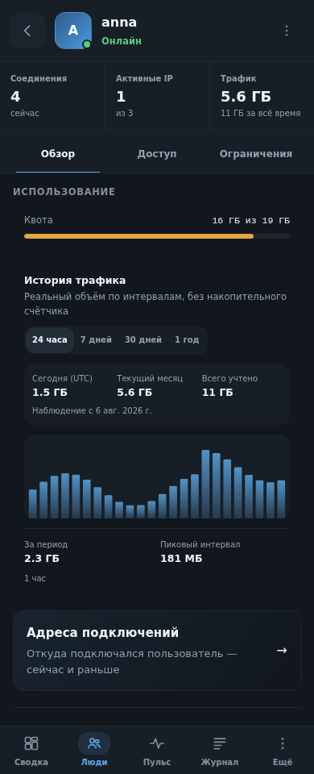
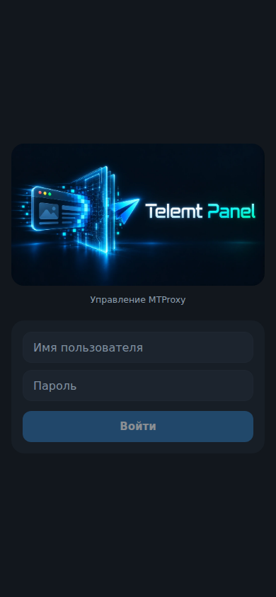
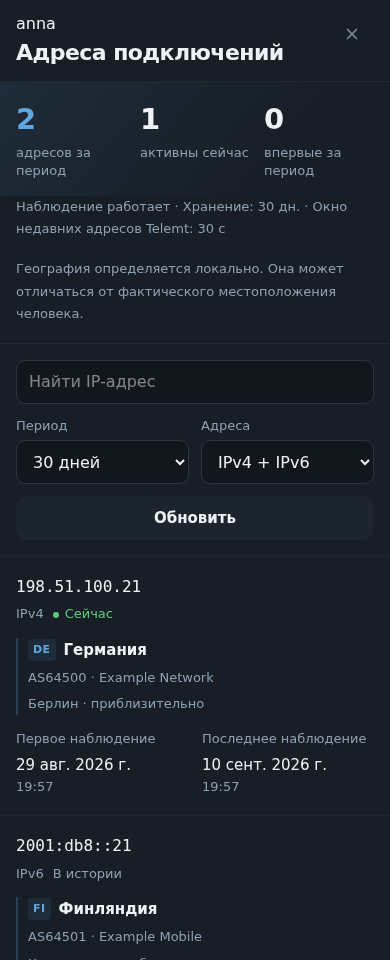

<p align="center">
  
</p>

<p align="center">Клиенты, трафик и диагностика Telemt — в одной панели.</p>

Веб-панель для личного [Telemt](https://github.com/telemt/telemt)-сервера:
от быстрой проверки состояния до подробного объяснения его метрик.
Работает на телефоне, планшете и компьютере. Интерфейс — на русском и английском.

> Документация относится к Telemt Panel **1.x**. Ветка `legacy` — версия **0.6.2**.



*Скриншоты сделаны в работающем интерфейсе на демонстрационных данных.
Имена, адреса и значения не относятся к серверам пользователей.*

## Возможности

- **Сводка** — ключевые показатели, проблемы, клиенты, пары RPC/Media для DC
  и вертикальный таймлайн событий.
- **Пульс** — подробная диагностика соединений, DC, ME, апстримов, NAT/STUN,
  TLS, счётчиков, событий и WEB с пояснениями параметров и доступности источников.
- **Люди** — создание и редактирование пользователей, квоты и ограничения,
  ссылки подключения, WEB-профили, накопленный трафик и история IP.
- **История** — категории и сроки хранения выбирает администратор. География
  адресов определяется локально по MMDB: источник P3TERX, свои URL или файлы.
- **Сервер** — настройки Telemt через Config API, обычная и расширенная формы,
  TOML-редактор с предпросмотром изменений, обновления и управление службой.
- **Доступ** — пароль и необязательные passkeys; встроенный ACME, свой сертификат,
  reverse proxy или явно выбранный HTTP. Есть PWA и мобильные меню/жесты.

Не все возможности Telemt включены в каждом его конфиге. Если источник
отключён или недоступен, панель объясняет это вместо вымышленных нулей.

## Интерфейс

<details>
<summary>Люди, Пульс и настройки — скриншоты десктопа</summary>

### Люди



### Пульс



### Конфигурация



</details>

<p>
  
  
</p>

<details>
<summary>Экран входа и история адресов</summary>

<p>
  
  
</p>

</details>

## Требования

- Linux **x86_64 или aarch64**, как у официальных сборок Telemt. ARMv7/MIPS
  не выпускаются; для Telemt x86_64-v3 подходит обычная панель x86_64.
- Работающий Telemt с доступным HTTP API. Переход и настройки проверялись
  на Telemt 3.5.5; отдельные возможности зависят от версии и конфигурации сервиса.
- Для изменения настроек Telemt нужен его **Config API**. Прямой записи файла
  Telemt панель не выполняет.
- Для установки — root либо sudo. Установщик поддерживает systemd, OpenRC,
  procd/OpenWrt и SysVinit. Docker-управление доступно при ручной настройке
  окружения и прав, но установщик не создаёт контейнеры.

Панель поставляется одним статическим бинарником со встроенным интерфейсом.
Node.js и Go на сервере не нужны. Telemt устанавливается отдельно.

## Установка

Для контейнерного запуска: [Docker / Compose](docs/DOCKER.md).
Тестовый образ — `ghcr.io/amirotin/telemt_panel:1.0.0-rc.1` (amd64/arm64).

Скачайте установщик и выберите **опубликованный тег 1.x** на странице
[релизов](https://github.com/amirotin/telemt_panel/releases).
Команда ниже показывает пример для `v1.0.0`; выполняйте её только после
публикации этого тега. Установщик скачивается из того же тега, что и бинарник.

```sh
curl -fsSL https://raw.githubusercontent.com/amirotin/telemt_panel/v1.0.0/install.sh -o install.sh
sh install.sh --version v1.0.0
```

Для локально собранной панели используйте `install.sh` из тех же исходников:

```sh
sh install.sh --binary /absolute/path/to/telemt-panel
```

Установщик спрашивает адрес API Telemt и заголовок авторизации, режим доступа,
логин/пароль, хранилище, пути и способ запуска. Перед изменениями показывает
сводку. Проверяет сумму загруженного архива и после запуска — доступность панели.

Страница подписки по умолчанию выключена. Её отдельный порт, внешний адрес,
путь и HTTPS настраиваются в веб-интерфейсе панели. Если включить её при установке,
первоначально она доступна только на `127.0.0.1:8081`.

| Сборка | История | Обычно используется |
| --- | --- | --- |
| **full** | SQLite или memory | На VPS и обычном сервере |
| **lite** | Только memory | В ограниченном окружении, например OpenWrt |

Обе сборки доступны для обеих архитектур. `--variant full|lite` задаёт выбор явно.
Для просмотра плана есть `--dry-run`; временные проверки и загрузки при этом
возможны, но установленная панель не меняется. Все параметры: `sh install.sh help`.

### Доступ к панели

| Вариант | Что потребуется |
| --- | --- |
| Встроенный ACME | Домен, корректные A/AAAA и доступный TCP/80; основной HTTPS обычно на 8443 |
| Готовый сертификат | PEM fullchain и ключ, читаемые пользователем службы |
| nginx/Caddy | Внешний HTTPS и доверие только своему reverse proxy |
| HTTP без TLS | Осознанное решение: публичное соединение не шифруется |

ACME работает внутри панели, без acme.sh и cron. Установщик может открыть порты
в **уже активном UFW/firewalld только с отдельного согласия**. Он не настраивает
NAT или firewall провайдера. При смене порта через интерфейс откройте его сами.

В режиме `--yes` для новой установки нужен `TP_ADMIN_PASSWORD`; без явно заданного
`TP_TLS_MODE` выбирается HTTP с предупреждением. `--yes` не разрешает изменение
firewall: для автоматизации требуется отдельный `TP_OPEN_FIREWALL=yes`.

Параметры HTTP/HTTPS и примеры nginx/Caddy — в [справочнике конфигурации](docs/CONFIG.md).

## Данные и резервные копии

Настройки, сессии и passkeys хранятся в `data_dir/panel-state.json`.
SQLite используется **только для истории наблюдений**, а не как обязательная
база для входа. При её недоступности панель может работать с временной историей
и предупреждением. Ошибки конфига и несовместимая схема БД не скрываются этим режимом.

На обычном сервере установщик использует `/var/lib/telemt-panel` и SQLite.
На OpenWrt по умолчанию — `/tmp/telemt-panel` и memory: история исчезает после
рестарта процесса, а state в `/tmp` — после перезагрузки ОС. Для постоянного
состояния выберите постоянный каталог. Драйвер истории не меняет путь state.

Хранение трафика не создаёт данные за время, когда панель не наблюдала Telemt.
История IP содержит наблюдавшиеся адреса, а не журнал пакетов и не доказательство
числа физических людей: NAT и смена сети влияют на адреса.

Для резервирования сохраняйте конфиг, state, SQLite и TLS/ACME-ключи при
остановленной панели либо используйте предусмотренные команды `store export/import`
для состояния и истории. Они не заменяют копию TOML и сертификатов.
Храните резервные копии как секреты.

## Обновление и удаление

Установщик при обновлении существующей панели сохраняет TOML, unit/init-скрипт,
sudoers и firewall. Он заменяет бинарник с резервной копией, проверяет запуск
и при ошибке пытается восстановить прежний бинарник. Изменение путей или прав
требует отдельной настройки — повторный запуск не перегенерирует всё окружение.

При переходе с **0.6.2** старый TOML читается без перезаписи. Включённые проверки
версий переносятся без автоустановки, с интервалом 6 часов; отключённые остаются
отключёнными. Для
контролируемого перехода используйте установщик: старое самообновление из UI
не гарантирует откат после остановки старого процесса.

- [Обновление, откат и экспорт конфига 1.x](docs/UPGRADING.md)
- [Восстановление доступа](docs/ACCESS_RECOVERY.md)
- [Удаление панели](docs/REMOVAL.md): `uninstall` сохраняет конфиг и данные,
  `purge` удаляет проверенные каталоги панели; Telemt и внешние файлы сохраняются.

## Документация и сборка

- [Все параметры config.toml](docs/CONFIG.md) · [пример файла](config.example.toml)
- [Подготовка и проверка релиза](docs/RELEASING.md)
- [Разработка интерфейса и браузерные тесты](web/README.md)

Для сборки из исходников нужны Go версии из `go.mod` и Node.js 22:

```sh
make build
# или минимальный вариант:
make build-lite
```

Сборки и тесты для локальной разработки лучше выполнять в отдельной копии
исходников. Артефакты, локальные конфиги и данные не должны попадать в Git.
