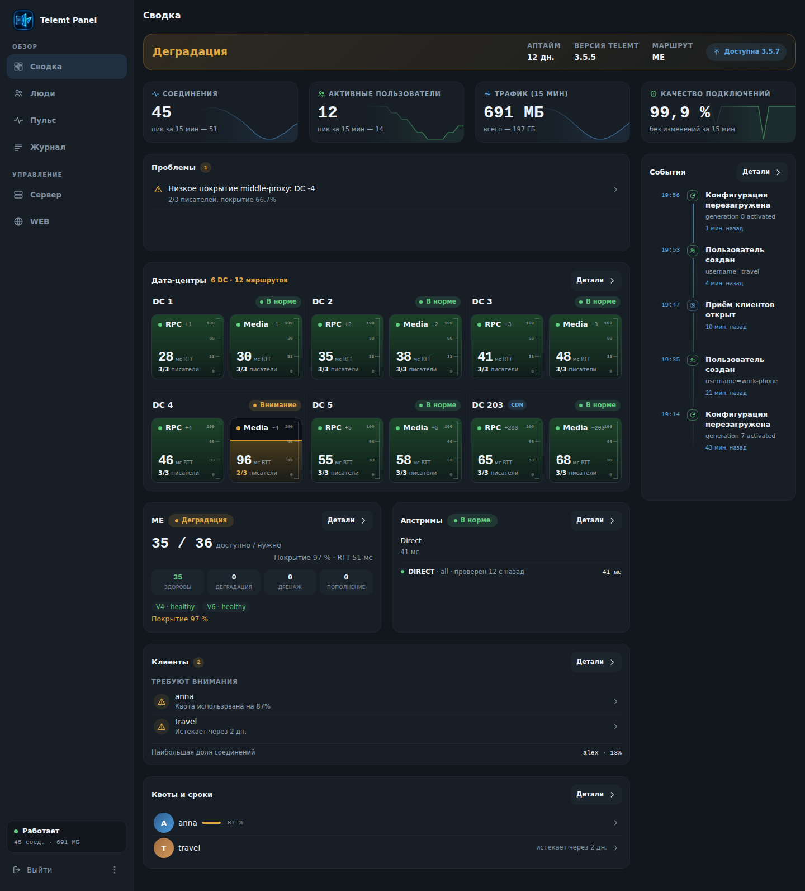
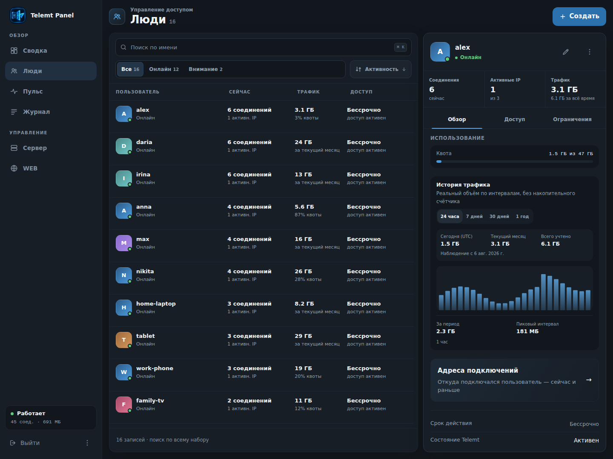
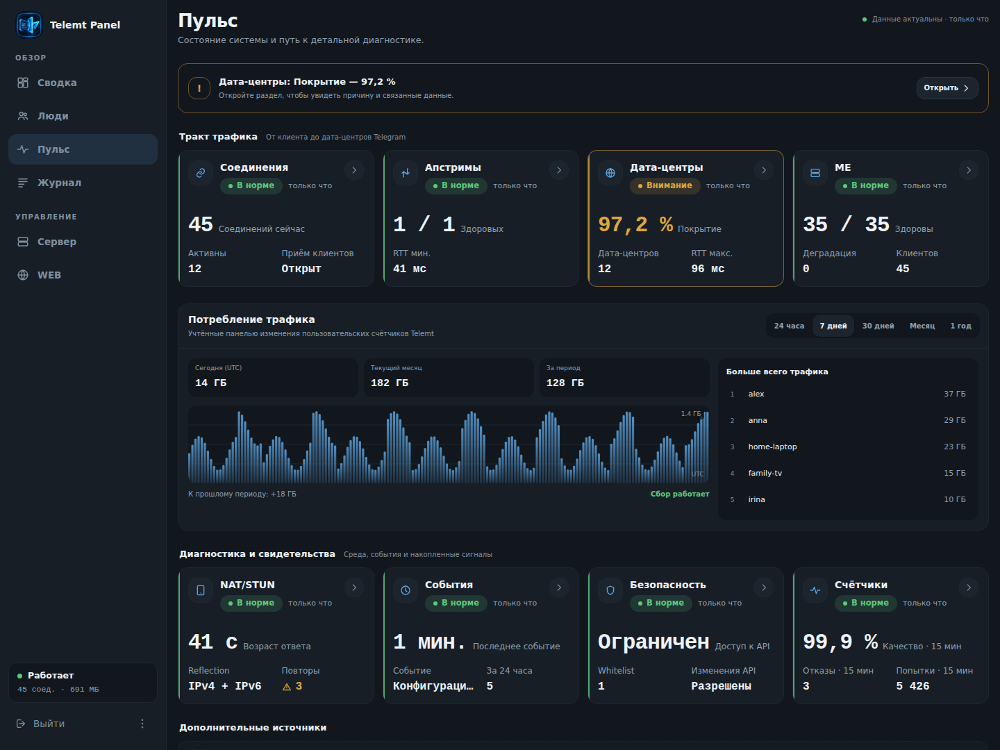
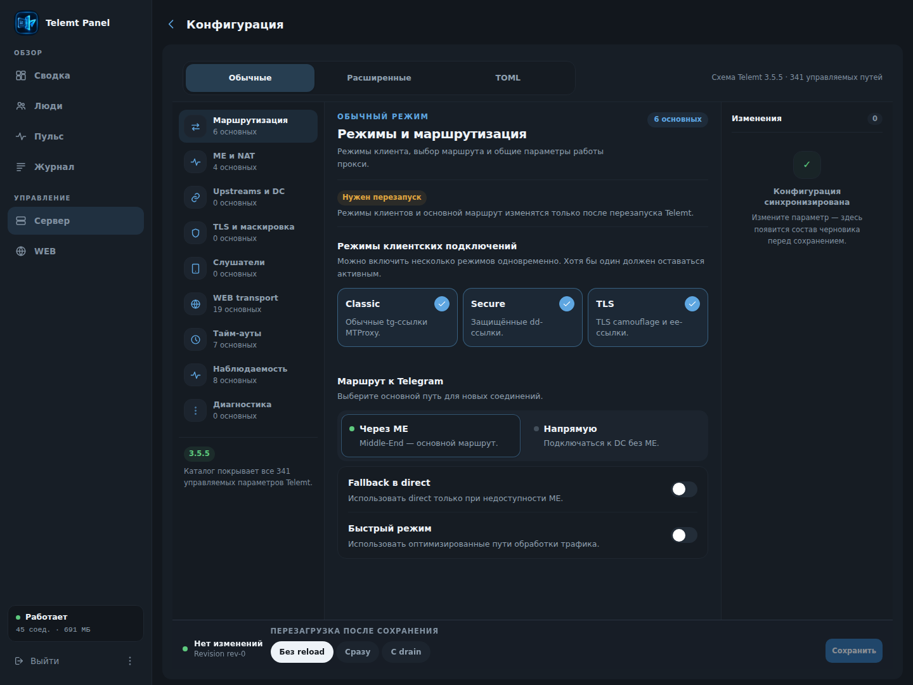
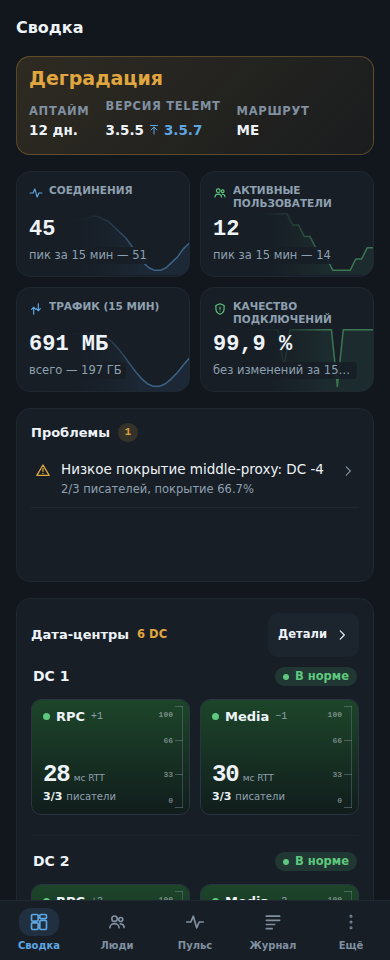
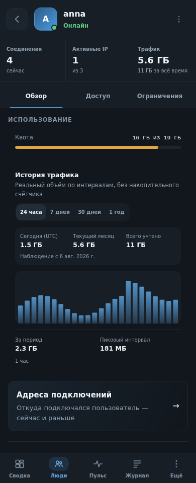
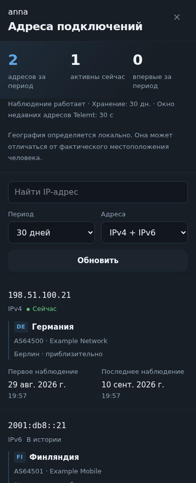

<p align="center">
  
</p>

<p align="center">Клиенты, трафик и диагностика Telemt — в одной панели.</p>

Веб-панель для личного [Telemt](https://github.com/telemt/telemt)-сервера:
от быстрой проверки состояния до подробного объяснения его метрик.
Работает на телефоне, планшете и компьютере. Интерфейс — на русском и английском.

> Документация относится к Telemt Panel **1.x**. Ветка `legacy` — версия **0.6.2**.



*Скриншоты сделаны в работающем интерфейсе на демонстрационных данных.
Имена, адреса и значения не относятся к серверам пользователей.*

## Возможности

- **Сводка** — ключевые показатели, проблемы, клиенты, пары RPC/Media для DC
  и вертикальный таймлайн событий.
- **Пульс** — подробная диагностика соединений, DC, ME, апстримов, NAT/STUN,
  TLS, счётчиков, событий и WEB с пояснениями параметров и доступности источников.
- **География** — отдельный раздел `/geography`: SVG-карта и переключаемый
  3D-глобус, страны, местоположения и связанные учётки для active IP либо истории
  за 24 часа / 7 / 30 дней. Координаты приблизительные; точка Telemt задаётся
  администратором. Без City-базы и в lite подсчёты и списки остаются доступны.
- **Пользователи** — создание и редактирование пользователей, квоты и ограничения,
  ссылки подключения, WEB-профили, накопленный трафик и история IP.
  Есть [массовый и плановый сброс расхода квот](docs/QUOTA_RESET.md): подтверждение,
  прогресс, общее расписание и индивидуальная вкладка «Автосброс».
- **История** — категории и сроки хранения выбирает администратор. География
  адресов определяется локально по MMDB из URL или файлов оператора. GeoIP
  выключен по умолчанию; [источники и происхождение баз](docs/CONFIG.md#geoip--источники-и-происхождение-баз).
- **Сервер** — настройки Telemt через Config API, обычная и расширенная формы,
  TOML-редактор с предпросмотром изменений, обновления и управление службой.
- **Доступ** — пароль и необязательные passkeys; встроенный ACME, свой сертификат,
  reverse proxy или явно выбранный HTTP. Есть PWA и мобильные меню/жесты.
- **Оформление** — своё название и логотип из файла на сервере либо вход без
  логотипа. Настраивается для всей панели; [подробнее](docs/BRANDING.md).

Не все возможности Telemt включены в каждом его конфиге. Если источник
отключён или недоступен, панель объясняет это вместо вымышленных нулей.

## Интерфейс

<details>
<summary>Пользователи, Пульс и настройки — скриншоты десктопа</summary>

### Пользователи



### Пульс



### Конфигурация

Вход можно отключить только через `[auth] disabled = true` с перезапуском,
если доступ уже защищён сетью или reverse proxy (например, mTLS).
Это открывает полный доступ всем, кто достиг порта панели; условия и настройка
домена описаны в [конфигурации](docs/CONFIG.md#auth--вход-администратора).



</details>

<p>
  
  
</p>

<details>
<summary>Экран входа и история адресов</summary>

<p>
  
  
</p>

</details>

## Требования

- Linux **x86_64 или aarch64**, как у официальных сборок Telemt. ARMv7/MIPS
  не выпускаются; для Telemt x86_64-v3 подходит обычная панель x86_64.
- Работающий Telemt с доступным HTTP API. Переход и настройки проверялись
  на Telemt 3.5.5; отдельные возможности зависят от версии и конфигурации сервиса.
- Для изменения настроек Telemt нужен его **Config API**. Прямой записи файла
  Telemt панель не выполняет.
- Для установки — root либо sudo. Установщик поддерживает systemd, OpenRC,
  procd/OpenWrt, SysVinit и раскладку Entware под `/opt`. Docker-управление доступно при ручной настройке
  окружения и прав, но установщик не создаёт контейнеры.
- Для нестандартных служб доступны [пользовательские команды и Entware](docs/ENTWARE.md).

Панель поставляется одним статическим бинарником со встроенным интерфейсом.
Node.js и Go на сервере не нужны. Telemt устанавливается отдельно.

## Установка

Для контейнерного запуска: [Docker / Compose](docs/DOCKER.md).
Для RC3 укажите `ghcr.io/amirotin/telemt_panel:1.0.0-rc.3`
(amd64/arm64); Compose требует явного выбора тега. При переходе с root-образа
RC2 сначала выполните миграцию владельцев config/data из инструкции Docker.

Скачайте установщик и выберите **опубликованный тег 1.x** на странице
[релизов](https://github.com/amirotin/telemt_panel/releases).
Текущий тестовый выпуск — **`v1.0.0-rc.3`**, предварительная версия для
пользовательской проверки перед стабильным 1.0. Установщик скачивается из
того же тега, что и бинарник. Перед обновлением сохраните конфиг и данные.

```sh
curl -fsSL https://raw.githubusercontent.com/amirotin/telemt_panel/v1.0.0-rc.3/install.sh -o install.sh
sh install.sh --version v1.0.0-rc.3
```

Для локально собранной панели используйте `install.sh` из тех же исходников:

```sh
sh install.sh --binary /absolute/path/to/telemt-panel
```

Установщик спрашивает адрес API Telemt и заголовок авторизации, режим доступа,
логин/пароль, хранилище, пути и способ запуска. Перед изменениями показывает
сводку. Проверяет сумму загруженного архива и после запуска — доступность панели.

В режиме reverse proxy дополнительно выбирается путь: корень домена (по умолчанию),
свой или случайный. Установщик записывает `base_path` и показывает примеры nginx/Caddy,
но не меняет конфигурацию прокси. Для установки с `--yes` можно передать
`TP_TLS_MODE=proxy TP_BASE_PATH=/panel` или `TP_BASE_PATH=random`.

Страница подписки по умолчанию выключена. Её отдельный порт, внешний адрес,
путь и HTTPS настраиваются в веб-интерфейсе панели. Если включить её при установке,
первоначально она доступна только на `127.0.0.1:8081`.

| Сборка | История | Обычно используется |
| --- | --- | --- |
| **full** | SQLite или memory | На VPS и обычном сервере |
| **lite** | Только memory | В ограниченном окружении, например OpenWrt |

Обе сборки доступны для обеих архитектур. `--variant full|lite` задаёт выбор явно.
Для просмотра плана есть `--dry-run`; временные проверки и загрузки при этом
возможны, но установленная панель не меняется. Все параметры: `sh install.sh help`.

Установщик проверяет поддержку `update-worker` выбранным бинарником. Для нового
протокола он создаёт отдельную службу обновления и небольшой скрипт восстановления
при запуске. Worker использует тот же бинарник и пользователя, что и панель,
и продолжает работу после её остановки. Постоянная вторая копия бинарника не нужна.
На OpenWrt очередь и восстановление хранятся в `/etc/telemt-panel/updater`,
а обычные данные панели остаются в RAM. После аварии worker запускается повторно.
Root-установки выполняют операции напрямую; для отдельного пользователя создаются
точные sudo-команды установки через stdin, замены файлов и управления службами.

| Настройка прав | По умолчанию |
| --- | --- |
| `privileges.mode` | `auto`: root, точные sudo-команды или ручные команды |
| `privileges.policy_path` | Путь policy старой helper-установки; новому worker не нужен |
| `privileges.helper_path` | Путь старого helper; новому worker не нужен |

Существующая helper-установка продолжает работать до обычного запуска нового
установщика от root. Он переводит управляемую службу на worker и удаляет helper
с policy после успешной проверки запуска. Для старого бинарника без нового
протокола сохраняется прежняя установка. Ремонт старой helper-схемы доступен через
`sh install.sh repair-privileges --user telemt-panel`; команда останавливает
панель, публикует отдельный stable helper, protected policy v2 и sudoers с откатом.
Конфиг и бинарники при этом сохраняются. Порядок — в [UPGRADING.md](docs/UPGRADING.md).

### Доступ к панели

| Вариант | Что потребуется |
| --- | --- |
| Встроенный ACME | Домен, корректные A/AAAA и доступный TCP/80; основной HTTPS обычно на 8443 |
| Готовый сертификат | PEM fullchain и ключ, читаемые пользователем службы |
| nginx/Caddy | Внешний HTTPS и доверие только своему reverse proxy |
| HTTP без TLS | Осознанное решение: публичное соединение не шифруется |

ACME работает внутри панели, без acme.sh и cron. Установщик может открыть порты
в **уже активном UFW/firewalld только с отдельного согласия**. Он не настраивает
NAT или firewall провайдера. При смене порта через интерфейс откройте его сами.

В режиме `--yes` для новой установки нужен `TP_ADMIN_PASSWORD`; без явно заданного
`TP_TLS_MODE` выбирается HTTP с предупреждением. `--yes` не разрешает изменение
firewall: для автоматизации требуется отдельный `TP_OPEN_FIREWALL=yes`.

Параметры HTTP/HTTPS и примеры nginx/Caddy — в [справочнике конфигурации](docs/CONFIG.md).
Для медленных хостов `[geography] build_timeout_secs` задаёт бюджет сборки карты:
по умолчанию 10 секунд, допустимо 1–120. После изменения нужен перезапуск;
таймаут reverse proxy должен быть не меньше бюджета сборки плюс 5 секунд.

## Данные и резервные копии

Настройки, сессии и passkeys хранятся в `data_dir/panel-state.json`.
SQLite используется **только для истории наблюдений**, а не как обязательная
база для входа. При её недоступности панель может работать с временной историей
и предупреждением. Ошибки конфига и несовместимая схема БД не скрываются этим режимом.

На обычном сервере установщик использует `/var/lib/telemt-panel` и SQLite.
На OpenWrt по умолчанию — `/tmp/telemt-panel` и memory: история исчезает после
рестарта процесса, а state в `/tmp` — после перезагрузки ОС. Для постоянного
состояния выберите постоянный каталог. Драйвер истории не меняет путь state.

Хранение трафика не создаёт данные за время, когда панель не наблюдала Telemt.
История IP содержит наблюдавшиеся адреса, а не журнал пакетов и не доказательство
числа физических людей: NAT и смена сети влияют на адреса.

В «Сервер → Настройки → История и хранение → История IP-адресов» задаётся число
адресов на пользователя: по умолчанию 256, либо режим «Без лимита на пользователя».
Настройка применяется без перезапуска. Общие пределы истории остаются 20 000
записей в памяти и 100 000 в SQLite. Она не ограничивает подключения Telemt
и не уменьшает число текущих адресов на карте; при сокращении сохранённой истории
панель просит подтверждение и оставляет самые недавно наблюдавшиеся адреса.

Для резервирования сохраняйте конфиг, state, SQLite и TLS/ACME-ключи при
остановленной панели либо используйте предусмотренные команды `store export/import`
для состояния и истории. Они не заменяют копию TOML и сертификатов.
Храните резервные копии как секреты.

## Обновление и удаление

Установщик заменяет бинарник с резервной копией и проверяет запуск. При переходе
на независимый worker он сохраняет пользователя и параметры существующей службы,
добавляет восстановление при запуске, отдельную службу обновления и необходимые
sudoers. Управляемая Entware-установка также получает команды остановки и запуска
панели в TOML. При ошибке возвращаются прежние бинарник, конфиг и файлы служб/прав.
`--no-start` оставляет старый helper до последующей проверки запуска. Произвольные
custom-команды и firewall сохраняются. Установка версии без worker поверх новой
worker-установки останавливается на предварительной проверке.
Повторный установщик использует `flock` и отказывает при активном или ожидающем
обновлении; блокировка сохраняется до завершения проверки либо отката.

При переходе с **0.6.2** старый TOML читается без перезаписи. Включённые проверки
версий переносятся без автоустановки, с интервалом 6 часов; отключённые остаются
отключёнными. Для
контролируемого перехода используйте установщик: старое самообновление из UI
не гарантирует откат после остановки старого процесса.

- [Обновление, откат и экспорт конфига 1.x](docs/UPGRADING.md)
- [Выбор версии и обновление через панель](docs/UPDATES.md)
- [Запуск, остановка и перезапуск Telemt](docs/SERVICE_CONTROL.md)
- [Восстановление доступа](docs/ACCESS_RECOVERY.md)
- [Удаление панели](docs/REMOVAL.md): `uninstall` сохраняет конфиг и данные,
  `purge` удаляет проверенные каталоги панели; Telemt и внешние файлы сохраняются.

## Документация и сборка

- [Все параметры config.toml](docs/CONFIG.md) · [пример файла](config.example.toml)
- [Выбор адреса подключения в ссылке](docs/CONNECTION_LINKS.md)
- [Подготовка и проверка релиза](docs/RELEASING.md)
- [Разработка интерфейса и браузерные тесты](web/README.md)

Для сборки из исходников нужны Go версии из `go.mod` и Node.js 22:

```sh
make build
# или минимальный вариант:
make build-lite
```

Сборки и тесты для локальной разработки лучше выполнять в отдельной копии
исходников. Артефакты, локальные конфиги и данные не должны попадать в Git.

## Лицензия

Панель распространяется по [MIT](LICENSE), copyright (c) 2026 telemt_panel
contributors. Сторонние библиотеки и географические данные сохраняют свои
[лицензии и attribution](THIRD_PARTY_NOTICES.md). Тексты встроены в бинарник
и доступны до входа по `licenses/LICENSE.txt` и
`licenses/THIRD_PARTY_NOTICES.txt` с учётом настроенного `base_path`.
Release tar.gz содержит единственный исполняемый файл; отдельная установка
license-файлов не требуется.
